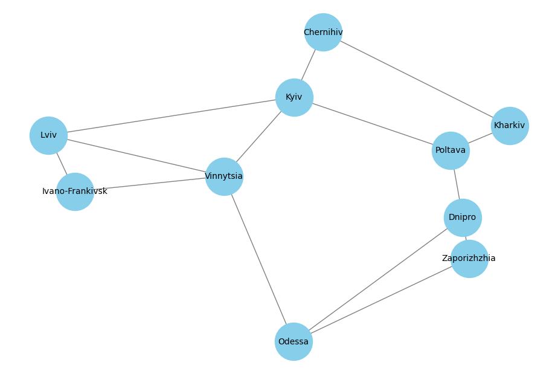

# Graph Algorithms Project

This repository contains implementations of graph-based algorithms using Python and the NetworkX library. The project models a network of Ukrainian cities, enabling us to run various traversal and pathfinding algorithms to analyze this network.

## Tasks Overview

### Task 1: Graph Creation and Analysis

In this task, we created a graph representing a real network of Ukrainian cities. Each city is a node in the graph, and edges represent possible routes between cities, with assigned weights (distances in kilometers).

The graph includes the following cities:

- Kyiv
- Lviv
- Odessa
- Kharkiv
- Dnipro
- Zaporizhzhia
- Ivano-Frankivsk
- Chernihiv
- Poltava
- Vinnytsia

Edges with weights were added to model real distances between these cities. Basic characteristics of the graph were analyzed, including the number of vertices (nodes) and edges. Visualization and analysis helped us understand the network structure before applying algorithms to it.

#### Execution Results

```bash
Number of nodes (cities): 10
Number of edges (connections): 14
Degree of each node (city): {'Kyiv': 4, 'Lviv': 3, 'Odessa': 3, 'Kharkiv': 2, 'Dnipro': 3, 'Zaporizhzhia': 2, 'Ivano-Frankivsk': 2, 'Chernihiv': 2, 'Poltava': 3, 'Vinnytsia': 4}
```

<div align="center">
    
</div>

### Task 2: DFS and BFS Traversals

We implemented two traversal algorithms, Depth-First Search (DFS) and Breadth-First Search (BFS), to explore paths within the city graph created in Task 1.

#### Execution Results

The traversal orders for DFS and BFS are as follows:

```bash
DFS execution:
Kyiv Poltava Dnipro Zaporizhzhia Odessa Vinnytsia Lviv Ivano-Frankivsk Kharkiv Chernihiv
BFS execution:
Kyiv Lviv Vinnytsia Poltava Chernihiv Ivano-Frankivsk Odessa Kharkiv Dnipro Zaporizhzhia
```

#### Comparison and Analysis

The main difference between DFS and BFS traversal orders stems from their inherent strategies:

- **DFS** explores as far as possible along each branch before backtracking, leading to deeper, isolated paths before moving to other nodes.
- **BFS**, on the other hand, explores nodes in a layer-wise manner, visiting all nodes at the current distance before moving further away.

Thus, DFS provides a path that dives deep into specific routes, which might be useful for scenarios requiring exploration of paths until a specific endpoint is found. BFS covers nodes in broader layers, making it preferable for finding shortest paths in terms of the number of edges.

### Task 3: Dijkstra's Algorithm for Shortest Path

In this task, we implemented Dijkstra's algorithm to find the shortest paths between all pairs of cities in the graph. This involved assigning weights to the edges (representing distances between cities) and calculating the shortest path from each node to every other node in the graph.

#### Execution Results

For each pair of cities, the shortest path length (in kilometers) was computed. Dijkstra’s algorithm effectively identifies the shortest routes, helping us understand the optimal paths within this network of Ukrainian cities.

```bash
      City      |   Kyiv   |   Lviv   |  Odessa  | Kharkiv  |  Dnipro  |Zaporizhzh|Ivano-Fran|Chernihiv | Poltava  |Vinnytsia
----------------+----------+----------+----------+----------+----------+----------+----------+----------+----------+----------
Kyiv            |         0|       540|       710|       360|       555|       640|       640|       140|       340|       270
Lviv            |       540|         0|       810|       900|      1095|      1180|       140|       680|       880|       370
Odessa          |       710|       810|         0|       885|       530|       530|       810|       850|       745|       440
Kharkiv         |       360|       900|       885|         0|       355|       440|      1000|       220|       140|       630
Dnipro          |       555|      1095|       530|       355|         0|        85|      1195|       575|       215|       825
Zaporizhzhia    |       640|      1180|       530|       440|        85|         0|      1280|       660|       300|       910
Zaporizhzhia    |       640|      1180|       530|       440|        85|         0|      1280|       660|       300|       910
Ivano-Frankivsk |       640|       140|       810|      1000|      1195|      1280|         0|       780|       980|       370
Zaporizhzhia    |       640|      1180|       530|       440|        85|         0|      1280|       660|       300|       910
Ivano-Frankivsk |       640|       140|       810|      1000|      1195|      1280|         0|       780|       980|       370
Chernihiv       |       140|       680|       850|       220|       575|       660|       780|         0|       360|       410
Poltava         |       340|       880|       745|       140|       215|       300|       980|       360|         0|       610
Vinnytsia       |       270|       370|       440|       630|       825|       910|       370|       410|       610|         0
Zaporizhzhia    |       640|      1180|       530|       440|        85|         0|      1280|       660|       300|       910
Ivano-Frankivsk |       640|       140|       810|      1000|      1195|      1280|         0|       780|       980|       370
Chernihiv       |       140|       680|       850|       220|       575|       660|       780|         0|       360|       410
Poltava         |       340|       880|       745|       140|       215|       300|       980|       360|         0|       610
Zaporizhzhia    |       640|      1180|       530|       440|        85|         0|      1280|       660|       300|       910
Ivano-Frankivsk |       640|       140|       810|      1000|      1195|      1280|         0|       780|       980|       370
Chernihiv       |       140|       680|       850|       220|       575|       660|       780|         0|       360|       410
Zaporizhzhia    |       640|      1180|       530|       440|        85|         0|      1280|       660|       300|       910
Ivano-Frankivsk |       640|       140|       810|      1000|      1195|      1280|         0|       780|       980|       370
Zaporizhzhia    |       640|      1180|       530|       440|        85|         0|      1280|       660|       300|       910
Zaporizhzhia    |       640|      1180|       530|       440|        85|         0|      1280|       660|       300|       910
Zaporizhzhia    |       640|      1180|       530|       440|        85|         0|      1280|       660|       300|       910
Ivano-Frankivsk |       640|       140|       810|      1000|      1195|      1280|         0|       780|       980|       370
Chernihiv       |       140|       680|       850|       220|       575|       660|       780|         0|       360|       410
Zaporizhzhia    |       640|      1180|       530|       440|        85|         0|      1280|       660|       300|       910
Ivano-Frankivsk |       640|       140|       810|      1000|      1195|      1280|         0|       780|       980|       370
Chernihiv       |       140|       680|       850|       220|       575|       660|       780|         0|       360|       410
Poltava         |       340|       880|       745|       140|       215|       300|       980|       360|         0|       610
Vinnytsia       |       270|       370|       440|       630|       825|       910|       370|       410|       610|         0
Zaporizhzhia    |       640|      1180|       530|       440|        85|         0|      1280|       660|       300|       910
Ivano-Frankivsk |       640|       140|       810|      1000|      1195|      1280|         0|       780|       980|       370
Chernihiv       |       140|       680|       850|       220|       575|       660|       780|         0|       360|       410
Ivano-Frankivsk |       640|       140|       810|      1000|      1195|      1280|         0|       780|       980|       370
Chernihiv       |       140|       680|       850|       220|       575|       660|       780|         0|       360|       410
Chernihiv       |       140|       680|       850|       220|       575|       660|       780|         0|       360|       410
Poltava         |       340|       880|       745|       140|       215|       300|       980|       360|         0|       610
Vinnytsia       |       270|       370|       440|       630|       825|       910|       370|       410|       610|         0
```

## Installation and Usage

1. **Clone the repository**:

   ```bash
   git clone https://github.com/Iryna-Holova/goit-algo-hw-06.git
   cd goit-algo-hw-06
   ```

2. **Install dependencies**:

   ```bash
   pip install -r requirements.txt
   ```

3. **Run the Tasks**:

   - Task 1: Graph creation and visualization
   - Task 2: DFS and BFS traversals
   - Task 3: Dijkstra's algorithm for shortest paths

```bash
python task_1.py   # Create and analyze the graph
python task_2.py   # Run DFS and BFS traversals
python task_3.py   # Run Dijkstra's algorithm for shortest paths
```

## Conclusion

This project demonstrates how different graph traversal and pathfinding algorithms operate on a network graph. Using Ukrainian cities as nodes and distances as weights, we explored how DFS and BFS provide distinct traversal patterns and how Dijkstra's algorithm finds the most efficient routes. Each algorithm has its strengths and preferred use cases, depending on the graph structure and the type of path exploration needed.

## License

This project is licensed under the MIT License - see the [LICENSE](./LICENSE) file for details.
